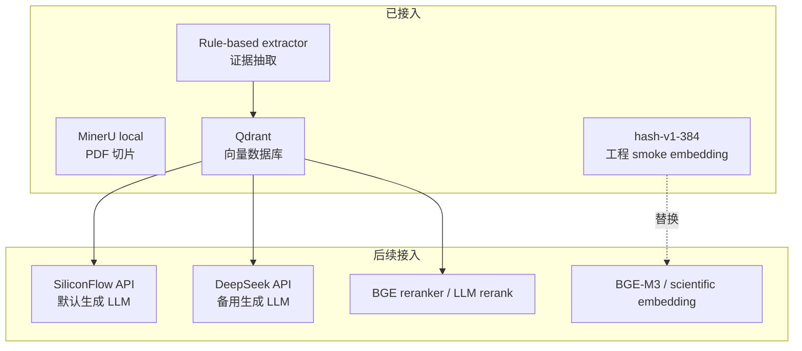

# 生机大模型：生物酶固定化推荐 MVP

面向脂肪酶固定化场景的 evidence-first RAG 原型。目标是让用户输入酶名或实验配方后，系统基于论文证据给出固化剂推荐、反应条件优化建议和可追溯 citation。

## 产品入口

静态前端原型位于：

```bash
web/index.html
```

打开方式：

```bash
python3 -m http.server 5173 -d web
```

访问：

```text
http://127.0.0.1:5173
```

## 系统架构


## 当前能力

| 模块 | 状态 | 说明 |
| --- | --- | --- |
| MinerU local `3.1.15` | 已验证 | B10 PDF smoke test 已打通 |
| RAG input builder | 已实现 | MinerU artifact -> `rag_chunks/table_records/extraction_candidates` |
| Evidence extractor | 已实现 | 规则抽取 enzyme、carrier、conditions、metrics、table rows |
| Qdrant `1.18.0` | 已验证 | B10 collection 119 points |
| Runtime config | 已实现 | `configs/local.yaml` 统一管理引擎和 provider |
| Generator protocol | 已实现 | mock、SiliconFlow、DeepSeek provider 接口 |
| Recommendation service | 已实现 | 酶名 -> evidence retrieval -> 固定化方案候选 |
| Formulation optimizer | 已实现 | 用户配方 JSON -> 字段级优化建议与 citation |
| Web prototype | 已实现 | 绿色主题首页、问答入口、能力卡片 |

## 引擎与模型规划



硬约束：

- PDF parsing 只使用本地/自托管 MinerU。
- 天翼云 MinerU 不进入 MVP、外网部署或生产调用路径。
- SiliconFlow 是默认生成 LLM provider。
- DeepSeek 保留同协议 provider 接口。
- API key 只从环境变量读取，不写入仓库。

## Runtime 配置

默认配置：

```bash
configs/local.yaml
```

校验配置和 mock generator：

```bash
PYTHONPATH=src .venv/bin/python scripts/check_runtime_config.py \
  --config configs/local.yaml \
  --run-mock-generation
```

关键配置片段：

```yaml
generator:
  provider: mock
  temperature: 0.1

generator_providers:
  siliconflow:
    enabled: false
    api_key_env: SILICONFLOW_API_KEY
  deepseek:
    enabled: false
    api_key_env: DEEPSEEK_API_KEY
```

## Qdrant 本地检索

启动本地 Qdrant：

```bash
scripts/start_qdrant_local.sh
```

索引 B10：

```bash
PYTHONPATH=src .venv/bin/python scripts/index_rag_qdrant.py \
  --rag-input-dir artifacts/rag_inputs/B10 \
  --evidence-dir artifacts/evidence/B10 \
  --collection enzyme_immobilization_b10 \
  --recreate
```

检索证据：

```bash
PYTHONPATH=src .venv/bin/python scripts/search_rag_qdrant.py \
  "This study soybean oil ethanol yield 93.4 8 cycles last yield" \
  --collection enzyme_immobilization_b10 \
  --top-k 1 \
  --usable-only \
  --context
```

停止 Qdrant：

```bash
scripts/stop_qdrant_local.sh
```

## 推荐 API Smoke Test

当前已有 `recommend_by_enzyme` CLI，会执行：

```text
enzyme query -> Qdrant retrieval -> evidence context -> generator protocol -> recommendation JSON
```

B10 smoke：

```bash
PYTHONPATH=src .venv/bin/python scripts/recommend_by_enzyme.py \
  "Burkholderia cepacia lipase" \
  --config configs/local.yaml \
  --collection enzyme_immobilization_b10 \
  --application-context "biodiesel production from soybean oil with ethanol" \
  --top-k 5 \
  --pretty
```

当前默认使用 `mock` generator，只验证推荐链路和输出结构。接入 SiliconFlow/DeepSeek 后，generator provider 会复用同一 protocol。

## 配方优化 Smoke Test

输入示例：

```bash
schemas/examples/formulation_optimization_input.example.json
```

执行：

```bash
PYTHONPATH=src .venv/bin/python scripts/optimize_formulation.py \
  "Burkholderia cepacia lipase" \
  --formulation schemas/examples/formulation_optimization_input.example.json \
  --config configs/local.yaml \
  --collection enzyme_immobilization_b10 \
  --application-context "biodiesel production from soybean oil with ethanol" \
  --top-k 5 \
  --pretty
```

输出会包含：

```text
changes[].field_path
changes[].current_value
changes[].recommended_value
changes[].evidence_ids
changes[].citations
limitations
next_experiment_suggestions
```

当前默认使用 deterministic evidence fallback，因此即使 generator 还是 `mock`，也能先跑通“用户配方 -> RAG evidence -> 字段级建议”的 MVP 链路。

## B10 Smoke Test 结果

| 指标 | 数值 |
| --- | --- |
| PDF pages | 14 |
| RAG chunks | 36 |
| Table records | 2 |
| Evidence records | 81 |
| Review queue | 24 |
| Qdrant points | 119 |

已验证的关键 evidence：

```text
B. cepacia lipase
Soybean oil
Solvent-free
Ethanol
Yield 93.4%
8 cycles
Last yield 71.3%
Citation: B10.pdf:p8
```

## 下一步

1. 接入真实 SiliconFlow generator。
2. 保留 DeepSeek adapter 并做 provider 对照。
3. 将 `hash-v1-384` 替换为专业 scientific embedding。
4. 批量处理 5-20 篇 PDF，建立 review/curation 闭环。
5. 增加 FastAPI 服务层，把 recommendation / optimization 暴露为稳定 API。
