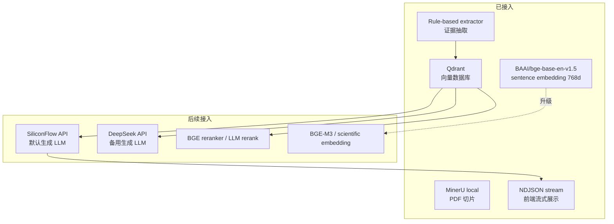

# 生机大模型：生物酶固定化推荐 MVP

面向脂肪酶固定化场景的 evidence-first RAG 原型。目标是让用户输入酶名或实验配方后，系统基于论文证据给出固化剂推荐、反应条件优化建议和可追溯 citation。

## 产品入口

静态前端原型位于：

```bash
web/index.html
```

打开方式：

```bash
python3 -m http.server 5173 -d web
```

访问：

```text
http://127.0.0.1:5173
```

## 系统架构


## 当前能力

| 模块 | 状态 | 说明 |
| --- | --- | --- |
| MinerU local `3.1.15` | 已验证 | B10 PDF smoke test 已打通 |
| RAG input builder | 已实现 | MinerU artifact -> `rag_chunks/table_records/extraction_candidates` |
| Evidence extractor | 已实现 | 规则抽取 enzyme、carrier、conditions、metrics、table rows |
| Qdrant `1.18.0` | 已验证 | 当前 collection 2508 points |
| Runtime config | 已实现 | `configs/local.yaml` 统一管理引擎和 provider |
| Generator protocol | 已实现 | mock、SiliconFlow、DeepSeek provider 接口，支持 token streaming |
| Recommendation service | 已实现 | 酶名 -> evidence retrieval -> 固定化方案候选 |
| Formulation optimizer | 已实现 | 用户配方 JSON -> 字段级优化建议与 citation |
| FastAPI backend | 已实现 | `/api/health`、推荐、配方优化、证据检索、NDJSON 流式接口 |
| Web prototype | 已实现 | 绿色主题首页、问答入口、流式生成结果 |

## 引擎与模型规划



硬约束：

- PDF parsing 只使用本地/自托管 MinerU。
- 天翼云 MinerU 不进入 MVP、外网部署或生产调用路径。
- SiliconFlow 是默认生成 LLM provider。
- DeepSeek 保留同协议 provider 接口。
- API key 只从环境变量读取，不写入仓库。

## Runtime 配置

默认配置：

```bash
configs/local.yaml
```

校验配置和真实 generator：

```bash
PYTHONPATH=src .venv/bin/python scripts/check_runtime_config.py \
  --config configs/local.yaml \
  --run-generation
```

关键配置片段：

```yaml
generator:
  provider: siliconflow
  temperature: 0.1

generator_providers:
  siliconflow:
    enabled: true
    api_key_env: SILICONFLOW_API_KEY
    model: deepseek-ai/DeepSeek-V3.2
  deepseek:
    enabled: false
    api_key_env: DEEPSEEK_API_KEY
```

本地密钥放在 `.env.local`，该文件已被 `.gitignore` 排除：

```bash
SILICONFLOW_API_KEY=...
```

真实 generation smoke：

```bash
PYTHONPATH=src .venv/bin/python scripts/check_runtime_config.py \
  --config configs/local.yaml \
  --run-generation
```

## Qdrant 本地检索

启动本地 Qdrant：

```bash
scripts/start_qdrant_local.sh
```

索引 B10：

```bash
PYTHONPATH=src .venv/bin/python scripts/index_rag_qdrant.py \
  --rag-input-dir artifacts/rag_inputs/B10 \
  --evidence-dir artifacts/evidence/B10 \
  --collection enzyme_immobilization_b10 \
  --recreate
```

检索证据：

```bash
PYTHONPATH=src .venv/bin/python scripts/search_rag_qdrant.py \
  "This study soybean oil ethanol yield 93.4 8 cycles last yield" \
  --collection enzyme_immobilization_b10 \
  --top-k 1 \
  --usable-only \
  --context
```

停止 Qdrant：

```bash
scripts/stop_qdrant_local.sh
```

## FastAPI 后端

启动 API：

```bash
scripts/start_api.sh
```

默认地址：

```text
http://127.0.0.1:8001
```

可用接口：

```text
GET  /api/health
POST /api/recommend/by-enzyme
POST /api/recommend/by-enzyme/stream
POST /api/optimize/formulation
POST /api/optimize/formulation/stream
POST /api/search/evidence
```

流式接口返回 `application/x-ndjson`，事件类型包括 `status`、`retrieval`、`delta`、`final`、`error`。Web 工作台默认使用 stream endpoint；旧 JSON 接口保留给 CLI、脚本和 smoke test。

推荐接口 smoke：

```bash
curl -sS http://127.0.0.1:8001/api/recommend/by-enzyme \
  -H 'Content-Type: application/json' \
  -d '{"enzyme_name":"Burkholderia cepacia lipase","application_context":"biodiesel production from soybean oil with ethanol","collection":"enzyme_immobilization_b10","top_k":5}'
```

错误处理：

```json
{
  "error": {
    "code": "runtime_error",
    "message": "cannot connect to Qdrant..."
  }
}
```

前端默认请求：

```text
http://127.0.0.1:8001
```

静态前端启动：

```bash
python3 -m http.server 5173 -d web
```

访问：

```text
http://127.0.0.1:5173
```

## 推荐 API Smoke Test

当前已有 `recommend_by_enzyme` CLI，会执行：

```text
enzyme query -> Qdrant retrieval -> evidence context -> generator protocol -> recommendation JSON
```

B10 smoke：

```bash
PYTHONPATH=src .venv/bin/python scripts/recommend_by_enzyme.py \
  "Burkholderia cepacia lipase" \
  --config configs/local.yaml \
  --collection enzyme_immobilization_b10 \
  --application-context "biodiesel production from soybean oil with ethanol" \
  --top-k 5 \
  --pretty
```

当前默认使用 SiliconFlow generator，输出会保留结构化候选、LLM 生成的 limitations、下一步实验建议和 evidence citations。`mock` provider 仍保留为离线开发 fallback。

## 配方优化 Smoke Test

输入示例：

```bash
schemas/examples/formulation_optimization_input.example.json
```

执行：

```bash
PYTHONPATH=src .venv/bin/python scripts/optimize_formulation.py \
  "Burkholderia cepacia lipase" \
  --formulation schemas/examples/formulation_optimization_input.example.json \
  --config configs/local.yaml \
  --collection enzyme_immobilization_b10 \
  --application-context "biodiesel production from soybean oil with ethanol" \
  --top-k 5 \
  --pretty
```

输出会包含：

```text
changes[].field_path
changes[].current_value
changes[].recommended_value
changes[].evidence_ids
changes[].citations
limitations
next_experiment_suggestions
```

当前默认使用 SiliconFlow generator；如果 LLM 没有返回合格的 `changes[]`，服务层会回退到 deterministic evidence fallback，保证“用户配方 -> RAG evidence -> 字段级建议”的 MVP 链路可用。

## 当前批处理进度

| 指标 | 数值 |
| --- | --- |
| PDF 总数 | 97 |
| 已完成 RAG + evidence | 27 |
| 待处理 PDF | 70 |
| Parsed pages | 323 |
| RAG chunks | 1099 |
| Table records | 53 |
| Evidence records | 1356 |
| Review queue | 411 |
| Qdrant points | 2508 |

当前 collection 仍沿用早期 smoke 名称 `enzyme_immobilization_b10`，但内容已经扩展到 27 篇文档；后续需要重建或迁移到正式 collection 名称。

## B10 Smoke Test 结果

| 指标 | 数值 |
| --- | --- |
| PDF pages | 14 |
| RAG chunks | 36 |
| Table records | 2 |
| Evidence records | 81 |
| Review queue | 24 |
| Qdrant points | 119 |

已验证的关键 evidence：

```text
B. cepacia lipase
Soybean oil
Solvent-free
Ethanol
Yield 93.4%
8 cycles
Last yield 71.3%
Citation: B10.pdf:p8
```

## 下一步

1. 跑完剩余 70 篇 PDF，并把批处理失败原因分为可重试、解析异常、文件损坏三类。
2. 将 411 条 review queue 建成 curated evidence 层，明确哪些记录可进入 ranking。
3. 将 `enzyme_immobilization_b10` 迁移/重建为正式 collection 名称，避免 smoke 命名污染生产配置。
4. 做 generator benchmark：DeepSeek-V3.2、DeepSeek-V4-Flash、Qwen3.6 小参数版本统一测 TTFT、tokens/s、JSON 合格率和 citation 引用准确率。
5. 增加 reranker、citation-aware answer check 和表格错列修复，提升推荐可信度。
