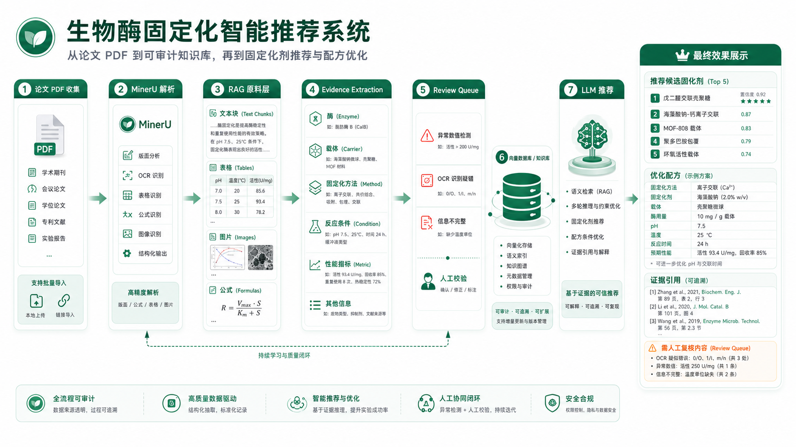
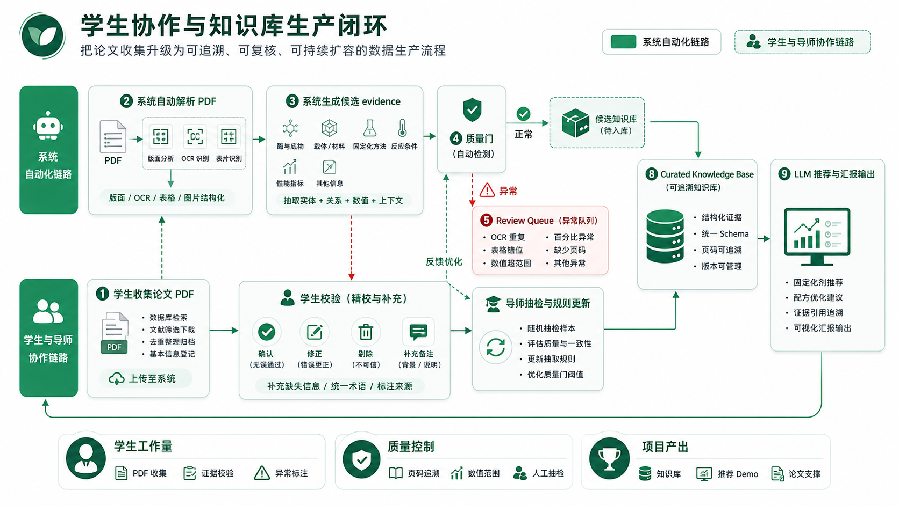
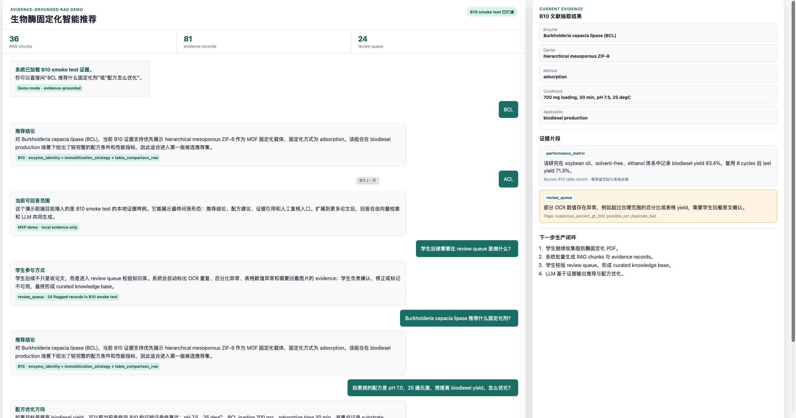

# 生物酶固定化智能推荐系统 MVP 阶段汇报

## 一、项目要解决什么问题

本项目目标是建设一个面向“生物酶固定化剂推荐与配方优化”的专业 AI 系统。它不是普通论文问答，而是把论文 PDF 中分散的酶、载体、固定化方法、配方条件、反应环境和性能指标，沉淀为可检索、可追溯、可人工复核的学科知识库。

最终使用效果是：用户输入一个酶名称，系统推荐候选固定化剂；用户继续输入配方比例、添加剂浓度、反应条件和应用场景，系统给出优化后的配方建议，并说明依据来自哪篇论文、哪一页、哪张表或哪段实验结果。

## 二、目前已经完成的工作

目前已经完成从论文 PDF 到证据型知识库原料的单篇闭环验证。测试文献选用一篇典型 MOF/ZIF-8 固定化 Burkholderia cepacia lipase 用于 biodiesel 制备的论文，覆盖了脂肪酶、MOF 载体、固定化条件、产率、复用性和表格对比等关键数据类型。

| 工作模块 | 已完成内容 | 体现的阶段价值 |
| --- | --- | --- |
| PDF 解析 | 本地部署 MinerU，真实解析论文 PDF | 不依赖外部不稳定服务，论文可批量进入系统 |
| Artifact 管理 | 生成 markdown、content list、middle json、table、图片证据 | 原文、表格、图示和版面信息可以追溯 |
| RAG 原料层 | 构建 text chunk、table record、extraction candidate | 为后续向量数据库和知识库检索打基础 |
| Evidence extraction | 自动抽取 enzyme、carrier、method、pH、temperature、loading、yield、reusability 等字段 | 从“论文文本”进入“结构化科研事实” |
| Review queue | 自动标记 OCR 异常、数值异常、表格异常和需人工确认内容 | 给学生后续校验提供明确工作入口 |
| 演示前端 | 已制作初步对话式 demo，展示推荐回答、证据引用和人工复核入口 | 领导和学生可以直观看到最终应用形态 |

当前单篇 B10 文献验证结果：

| 指标 | 结果 |
| --- | --- |
| PDF 页数 | 14 页 |
| MinerU content blocks | 131 个 |
| RAG chunks | 36 个 |
| 表格 records | 2 张表 |
| evidence records | 81 条 |
| review queue | 24 条 |
| 已抽取关键事实 | BCL、hierarchical mesoporous ZIF-8、adsorption、pH 7.5、25 degC、700 mg loading、biodiesel yield 93.4%、8 cycles |

## 三、最终可呈现的效果

系统最终呈现为一个“带证据的专业推荐助手”。例如用户输入“Burkholderia cepacia lipase 适合什么固定化剂”，系统会返回候选载体、推荐理由、适用场景、关键配方参数和论文证据；用户输入自己的配方条件后，系统会基于知识库给出优化建议，并区分哪些结论证据充分、哪些内容需要人工复核。

预期效果包括：

- 固定化剂推荐：根据酶类型、应用场景和性能指标推荐候选载体或固化剂。
- 配方优化建议：围绕 pH、温度、酶载量、吸附时间、添加剂和反应体系提出优化方向。
- 证据可追溯：每条建议都能追溯到论文、页码、表格或原文证据片段。
- 风险可控制：OCR 错误、异常百分比、表格错位等内容进入 review queue，不直接参与推荐排序。
- 汇报可视化：可通过前端 demo 展示“用户提问 - 系统推荐 - 证据引用 - 人工复核”的完整路径。

建议汇报配图：

## 四、学生协作机制

学生后续不只是做论文 PDF 收集，而是参与知识库生产。系统会把论文自动解析成候选证据，并把不确定、有风险或需要人工确认的内容推入 review queue。学生负责核对原文、修正字段、标记不可用证据和补充备注；导师或项目负责人可以抽检，持续优化抽取规则和标注规范。

学生工作可以拆成三类：

- 论文收集：按脂肪酶、载体类型、应用场景整理 PDF 与基础 metadata。
- 证据校验：在 review queue 中核对酶名称、载体、固定化方法、反应条件和性能指标。
- 知识库扩容：把确认后的证据沉淀为 curated knowledge base，为模型推荐提供可靠来源。

这套机制的价值是把“学生收集论文”升级为“学生参与建设学科知识库”。学生有明确任务，老师能看到产出，系统也能随着论文数量和人工校验不断变强。

## 五、前端设计

> **前端设计说明：** 上图展示了系统的前端界面设计方案。页面采用三栏式布局：
> - **左侧**：文献列表与检索区，支持快速筛选和浏览论文
> - **中间**：文献详细结构化提取结果展示（酶信息、固定化策略、性能指标等）
> - **右侧**：AI 推荐面板，基于多篇文献数据综合推理，输出最优固定化策略建议并附带证据追溯
>
> 整体设计旨在为研究人员提供 **"检索 → 提取 → 推荐"** 的一站式工作流体验。

## 六、下一阶段计划

建议下一步先扩展到 10-30 篇脂肪酶固定化论文，形成小规模 review queue 标注规范；随后接入向量数据库和 LLM 对话接口，完成可演示的固定化剂推荐 MVP。当前阶段已经证明核心链路可行，后续重点是批量化、人工校验规范化和推荐结果可解释化。
